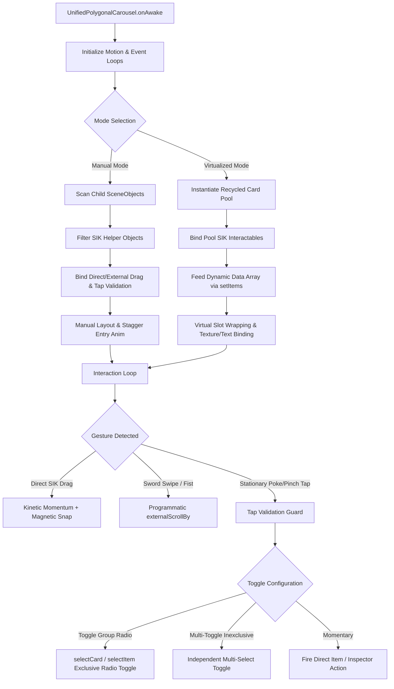

# UnifiedPolygonalCarousel System Guide & Complete Architectural Reference

The **UnifiedPolygonalCarousel** is the consolidated spatial carousel framework for **Snap Spectacles (2024)** and **Lens Studio 5.15+**. It replaces both the legacy standalone `ManualPolygonalCarousel` and `VirtualizedPolygonalCarousel` with a single, high-performance component supporting dual operational modes:

1. **Manual Mode**: Distributes pre-authored child buttons (`PolygonalButton`) in a circular arc with individual inspector callbacks, custom polygon geometry, and independent or radio-group toggle states.
2. **Virtualized Mode**: Dynamically recycles an object pool of card prefabs across infinite datasets via `setItems()`, minimizing draw calls and memory overhead.

---

## 🏛️ Architecture & Game Flow Map



---

## ⚖️ Operational Modes: Manual vs. Virtualized

| Feature | **Manual Mode** (`mode: "Manual"`) | **Virtualized Mode** (`mode: "Virtualized"`) |
| :--- | :--- | :--- |
| **Card Generation** | Operates directly on pre-placed child `SceneObjects` under `carouselRoot`. | Instantiates a recycled pool from a single `cardPrefab` template. |
| **Dataset Size** | Fixed, static button sets (e.g. 5, 8, 12 buttons). | Arbitrary, large, or streaming datasets (e.g. 20, 50, 100+ items). |
| **Card Geometry** | Each button can have unique polygon shapes, custom sizes, and bespoke iconography. | All cards share the template geometry; icons and texts are bound dynamically. |
| **Action Handling** | Individual button inspector callbacks or `ManualCarouselDemoController`. | Injected programmatically via `CarouselItemData.onTap(isSelected)`. |
| **Toggle Memory** | Hardware state machine synchronized across child `BaseButton` instances. | Tracked via data index set (`toggledDataIndices`) and restored during slot recycling. |

---

## 🎛️ Exact Inspector Configuration Recipes

### 1. Manual Carousel Production Preset (Reference Scene: `Manual Carousel Set Size`)

Below are the exact production inspector values tuned for a 12-button front-facing circular HUD arc:

```yaml
# Manual Mode Production Configuration
Core Setup:
  Mode: "Manual"
  Carousel Root: [Assigned SceneObject or Empty for Self]

Button Scale: 1.00

Arc & Circular Layout:
  Slot Count: 6
  Buffer Slots: 4
  Arc Angle Degrees: 180.00
  Arc Offset Degrees: 90.00
  Slot Offset: -2
  Radius: 5.50
  Layout Axis: "XY Plane (Flat Face-On Circle)"
  Align Rotation To Circle: true
  Face Inward: true
  Face Camera: false
  Rotation Offset: (0.00, 0.00, 90.00)
  Fade At Edges: true
  Fade Range: 2.20

Touch Drag & Physics:
  Enable Direct Drag: true
  Tap Drag Threshold: 1.50
  Enable External Drag: false
  Invert Drag: true
  Drag Sensitivity: 0.05
  Inertia Damping: 4.50
  Snap Sharpness: 10.00
  Min Velocity To Snap: 0.015
  Max Drag Velocity: 1.50
  Enable Toggle Group Behavior: true
  Allow All Toggles Off: true
  Make Buttons Toggleable: false

Stagger Animations:
  Enable Entry Animation: true
  Animate On Start: true
  Entry Duration: 0.50
  Entry Stagger Time: 0.05
  Stagger Direction: "Center Outward"
```

---

### 2. Runtime Virtualized Carousel Production Preset (Reference Scene: `Runtime Carousel`)

Below are the production inspector values tuned for dynamic data-fed carousels with external sword-swipe scrolling:

```yaml
# Virtualized Mode Production Configuration
Core Setup:
  Mode: "Virtualized"
  Card Prefab: [PolygonalButton Prefab Asset]

Arc & Circular Layout:
  Slot Count: 5
  Buffer Slots: 2
  Arc Angle Degrees: 270.00
  Arc Offset Degrees: 135.00
  Slot Offset: 0
  Radius: 30.00
  Layout Axis: "XY Plane (Flat Face-On Circle)"
  Align Rotation To Circle: true
  Face Inward: false
  Face Camera: false
  Rotation Offset: (0.00, 0.00, 90.00)
  Fade At Edges: true
  Fade Range: 1.00

Touch Drag & Physics:
  Enable Direct Drag: true
  Tap Drag Threshold: 0.80
  Enable External Drag: true
  Invert Drag: true
  Drag Sensitivity: 0.05
  Inertia Damping: 4.50
  Snap Sharpness: 10.00
  Min Velocity To Snap: 0.015
  Max Drag Velocity: 1.50
  Enable Toggle Group Behavior: true
  Allow All Toggles Off: false
  Make Buttons Toggleable: false

Stagger Animations:
  Enable Entry Animation: true
  Animate On Start: true
  Entry Duration: 0.50
  Entry Stagger Time: 0.05
  Stagger Direction: "Left to Right"
```

---

## 💻 TypeScript API & Integration

### Feeding Dynamic Data (Virtualized Mode)

```typescript
import { UnifiedPolygonalCarousel, CarouselItemData } from "./UnifiedPolygonalCarousel";

@component
export class CustomAppPopulator extends BaseScriptComponent {
    @input carousel!: UnifiedPolygonalCarousel;
    @input sampleIcons!: Texture[];

    onAwake(): void {
        this.createEvent("OnStartEvent").bind(() => this.initCarousel());
    }

    private initCarousel(): void {
        const items: CarouselItemData[] = [];
        for (let i = 0; i < 20; i++) {
            const title = `App ${i + 1}`;
            items.push({
                title: title,
                subtitle: "Spatial utility",
                texture: this.sampleIcons[i % this.sampleIcons.length],
                onTap: (isSelected?: boolean) => {
                    // Handle item selection/deselection
                }
            });
        }
        this.carousel.setItems(items);
    }
}
```

---

### Programmatic Selection & Callback Listening (Manual & Virtualized)

```typescript
// Register selection listener
carousel.onItemSelected = (index: number, itemOrCard?: any) => {
    if (index === -1) {
        // Deselected ("None Selected")
    } else {
        // Selected item index
    }
};

// Programmatically select card 2
carousel.selectCard(2);

// Programmatically deselect all cards
carousel.selectCard(-1);

// Programmatically trigger entry/exit animations
carousel.playEntryAnimation();
carousel.playExitAnimation();
```

---

### External Gesture Scrolling (e.g. `SwordSwipeScroller.ts`)

```typescript
// Drive carousel rotation via 2-finger hand swipe
carousel.externalScrollBy(deltaAngle);

// Multi-step gesture sequence
carousel.externalDragStart();
carousel.externalDragUpdate(dragAmount);
carousel.externalDragEnd(releaseVelocity);
```

---

## 🛡️ Critical Architecture Safeguards

1. **Z-Depth Penetration Filter**:
   - Standard 3D distance calculations treat pressing into an AR button (Z-axis push of 1.5cm - 2.5cm) as a drag. `UnifiedPolygonalCarousel` uses planar tangential displacement ($\sqrt{\Delta x^2 + \Delta y^2}$) to guarantee stationary pokes are never discarded as drags.
2. **SIK State Machine Toggle Synchronization**:
   - Directly synchronizes UIKit `BaseButton` internal state machine (`_interactableStateMachine.toggle`) on every state change, preventing toggle state resurrection upon finger unhover.
3. **Pre-Tap Snapshot Selection**:
   - Captures `triggerStartSelectedIndex` on touch down (`onTriggerStart`) to differentiate between selecting an unselected button and double-tapping an already active button, preventing same-tap toggle deselect bugs.
