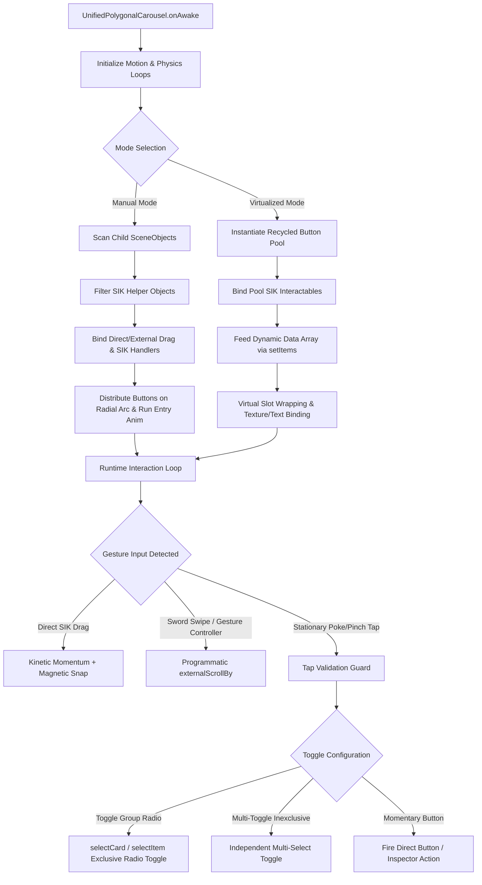

# UnifiedPolygonalCarousel System Guide & Complete Architectural Reference

The **UnifiedPolygonalCarousel** is the consolidated spatial carousel framework for **Snap Spectacles (2024)** and **Lens Studio 5.15+**. It merges both the legacy standalone `ManualPolygonalCarousel` and `VirtualizedPolygonalCarousel` into a single, high-performance component supporting dual operational modes:

1. **Manual Mode**: Distributes pre-authored child buttons (`PolygonalButton`) in a circular arc with individual inspector callbacks, custom polygon geometry, and independent or radio-group toggle states.
2. **Virtualized Mode**: Dynamically recycles an object pool of visual button templates across infinite datasets via `setItems()`, minimizing draw calls and memory overhead.

---

## 🏛️ Architecture & Interaction Flow Map



---

## ⚖️ Operational Modes: Manual vs. Virtualized

| Feature | **Manual Mode** (`mode: "Manual"`) | **Virtualized Mode** (`mode: "Virtualized"`) |
| :--- | :--- | :--- |
| **Button Generation** | Operates directly on pre-placed child `SceneObjects` under `carouselRoot`. | Instantiates a recycled pool from a single `cardPrefab` button template. |
| **Dataset Size** | Fixed, static button sets (e.g. 5, 8, 12 buttons). | Arbitrary, large, or streaming datasets (e.g. 20, 50, 100+ items). |
| **Button Geometry** | Each button can have unique polygon shapes, custom sizes, and bespoke iconography. | All buttons share the template geometry; icons and texts are bound dynamically. |
| **Action Handling** | Individual button inspector callbacks or `ManualCarouselDemoController`. | Injected programmatically via `CarouselItemData.onTap(isSelected)`. |
| **Toggle Memory** | Hardware state machine synchronized across child `BaseButton` instances. | Tracked via data index set (`toggledDataIndices`) and restored during slot recycling. |

---

## 💡 How the Demo & Populator Controllers Work

To help you build your own custom application controllers inspired by our sample scenes, here is an architectural breakdown of how both modes are utilized in code:

### 1. Manual Mode Controller: [`ManualCarouselDemoController.ts`](file:///d:/Lens%20Studio/Project%20Files/Spectacles/Gesture%20Experimentation/Futuristic%20Interfaces/Futuristic%20UIs%20v1/Assets/Futuristic%20UI%20v1%20Assets/Carousels/Manual%20Carousel%20%5BLegacy%5D/ManualCarouselDemoController.ts)

In Manual Mode, buttons exist as real SceneObjects in the hierarchy. The `ManualCarouselDemoController` orchestrates selection feedback, central HUD display updates, and smooth alpha transitions:

- **Scene-Wide Auto-Discovery**: On `onStart()`, the controller automatically scans the scene hierarchy to locate the active `UnifiedPolygonalCarousel` and hooks into its `onItemSelected` event.
- **Unified Toggle Group vs. Multi-Toggle Handling**:
  - **Radio Toggle Group (`isToggleGroup = true`)**: Tapping a button selects that button (`selectCard(index)`), fades all unselected buttons to `dimmedAlpha` (`0.2`), and highlights the selected button (`1.0` alpha). If `allowAllTogglesOff` is enabled, tapping the active button deselects it (`selectCard(-1)`), resetting the HUD display to `"None Selected"`.
  - **Independent Multi-Toggle (`isMultiToggle = true`)**: Tapping buttons toggles each button's active state independently inside a `toggledIndices` set without forcing unselected buttons off.
- **Smooth Visual Lerping**: In `onUpdate()`, the controller lerps the alpha of each button's background texture and text smoothly toward its target alpha without stutter.

```typescript
// Example: Creating your own Manual Mode listener script
import { UnifiedPolygonalCarousel } from "./UnifiedPolygonalCarousel";

@component
export class CustomManualHUD extends BaseScriptComponent {
    @input carousel!: UnifiedPolygonalCarousel;
    @input statusText!: Text;

    onAwake(): void {
        this.createEvent("OnStartEvent").bind(() => {
            // Listen for carousel selection events
            this.carousel.onItemSelected = (index: number, buttonObj?: SceneObject) => {
                if (index === -1) {
                    this.statusText.text = "No Feature Selected";
                } else {
                    this.statusText.text = `Feature ${index + 1} Activated`;
                }
            };
        });
    }
}
```

---

### 2. Virtualized Mode Populator: [`RuntimeCarouselExamplePopulator.ts`](file:///d:/Lens%20Studio/Project%20Files/Spectacles/Gesture%20Experimentation/Futuristic%20Interfaces/Futuristic%20UIs%20v1/Assets/Futuristic%20UI%20v1%20Assets/Carousels/Runtime%20Virtualized%20Carousel%20%5BLegacy%5D/RuntimeCarouselExamplePopulator.ts)

In Virtualized Mode, only a small pool of visual buttons (e.g. 8 slots) is instantiated. The `RuntimeCarouselExamplePopulator` feeds an arbitrary list of data items into the carousel at runtime:

- **Dynamic Data Generation**: Creates an array of `CarouselItemData` objects containing `title`, `subtitle`, `texture`, and a custom `onTap(isSelected)` closure.
- **Per-Item Action Closure**: The `onTap` callback receives a boolean indicating whether the item is currently selected (`true`) or deselected (`false`), allowing individual items to trigger bespoke game or UI logic.
- **Data Injection**: Calls `carousel.setItems(customItems)`. The carousel automatically handles the math of mapping those items across the recycled visual buttons as the user scrolls.
- **Initial State Setup**: Queries `allowAllTogglesOff` on the carousel. If `false`, it auto-selects item `0` on startup; if `true`, it begins in the neutral `"None Selected"` state.

```typescript
// Example: Creating your own Virtualized Populator
import { UnifiedPolygonalCarousel, CarouselItemData } from "./UnifiedPolygonalCarousel";

@component
export class CustomAppLauncherPopulator extends BaseScriptComponent {
    @input carousel!: UnifiedPolygonalCarousel;
    @input appIcons!: Texture[];

    onAwake(): void {
        this.createEvent("OnStartEvent").bind(() => this.populateApps());
    }

    private populateApps(): void {
        const appList: CarouselItemData[] = [];
        for (let i = 0; i < 24; i++) {
            const appName = `Spatial App ${i + 1}`;
            appList.push({
                title: appName,
                subtitle: "Tap to launch",
                texture: this.appIcons[i % this.appIcons.length],
                onTap: (isSelected?: boolean) => {
                    if (isSelected) {
                        print(`Launching ${appName}...`);
                    }
                }
            });
        }
        this.carousel.setItems(appList);
    }
}
```

---

## 🎛️ Exact Inspector Configuration Recipes

### 1. Manual Carousel Production Preset (Reference Scene: `Manual Carousel Set Size`)

Below are the exact production inspector values tuned for a 12-button front-facing circular HUD arc:

```yaml
# Manual Mode Production Configuration
Core Setup:
  Mode: "Manual"
  Carousel Root: [Assigned SceneObject or Empty for Self]

Button Scale: 1.00

Arc & Circular Layout:
  Slot Count: 6
  Buffer Slots: 4
  Arc Angle Degrees: 180.00
  Arc Offset Degrees: 90.00
  Slot Offset: -2
  Radius: 5.50
  Layout Axis: "XY Plane (Flat Face-On Circle)"
  Align Rotation To Circle: true
  Face Inward: true
  Face Camera: false
  Rotation Offset: (0.00, 0.00, 90.00)
  Fade At Edges: true
  Fade Range: 2.20

Touch Drag & Physics:
  Enable Direct Drag: true
  Tap Drag Threshold: 1.50
  Enable External Drag: false
  Invert Drag: true
  Drag Sensitivity: 0.05
  Inertia Damping: 4.50
  Snap Sharpness: 10.00
  Min Velocity To Snap: 0.015
  Max Drag Velocity: 1.50
  Enable Toggle Group Behavior: true
  Allow All Toggles Off: true
  Make Buttons Toggleable: false

Stagger Animations:
  Enable Entry Animation: true
  Animate On Start: true
  Entry Duration: 0.50
  Entry Stagger Time: 0.05
  Stagger Direction: "Center Outward"
```

---

### 2. Runtime Virtualized Carousel Production Preset (Reference Scene: `Runtime Carousel`)

Below are the production inspector values tuned for dynamic data-fed carousels with external sword-swipe scrolling:

```yaml
# Virtualized Mode Production Configuration
Core Setup:
  Mode: "Virtualized"
  Card Prefab: [PolygonalButton Prefab Asset]

Arc & Circular Layout:
  Slot Count: 5
  Buffer Slots: 2
  Arc Angle Degrees: 270.00
  Arc Offset Degrees: 135.00
  Slot Offset: 0
  Radius: 30.00
  Layout Axis: "XY Plane (Flat Face-On Circle)"
  Align Rotation To Circle: true
  Face Inward: false
  Face Camera: false
  Rotation Offset: (0.00, 0.00, 90.00)
  Fade At Edges: true
  Fade Range: 1.00

Touch Drag & Physics:
  Enable Direct Drag: true
  Tap Drag Threshold: 0.80
  Enable External Drag: true
  Invert Drag: true
  Drag Sensitivity: 0.05
  Inertia Damping: 4.50
  Snap Sharpness: 10.00
  Min Velocity To Snap: 0.015
  Max Drag Velocity: 1.50
  Enable Toggle Group Behavior: true
  Allow All Toggles Off: false
  Make Buttons Toggleable: false

Stagger Animations:
  Enable Entry Animation: true
  Animate On Start: true
  Entry Duration: 0.50
  Entry Stagger Time: 0.05
  Stagger Direction: "Left to Right"
```

---

## 🚀 Spatial UX Design Recommendation: Two-Handed Interaction

> [!TIP]
> **Decoupling Scroll from Selection**:
> When building spatial interfaces for AR glasses, single-hand direct poke-and-scroll on small buttons can cause accidental selections upon release.
> 
> The recommended spatial interaction pattern is:
> 1. **Anchor / Spawn**: Left hand closed fist (`Carousel Fist GestureApp.ts`).
> 2. **Scroll Wheel**: Right hand 2-finger swipe across the arc (`SwordSwipeScroller.ts` calling `carousel.externalScrollBy()`).
> 3. **Select Button**: Native SIK pinch (direct targeting).
>
> This separation of scroll input from selection input guarantees 100% reliable interaction without touch conflict.

---

## 🛡️ Critical Architecture Safeguards

1. **Z-Depth Penetration Filter**:
   - Standard 3D distance calculations treat pressing into an AR button (Z-axis push of 1.5cm - 2.5cm) as a drag. `UnifiedPolygonalCarousel` uses planar tangential displacement ($\sqrt{\Delta x^2 + \Delta y^2}$) to guarantee stationary pokes are never discarded as drags.
2. **SIK State Machine Toggle Synchronization**:
   - Directly synchronizes UIKit `BaseButton` internal state machine (`_interactableStateMachine.toggle`) on every state change, preventing toggle state resurrection upon finger unhover.
3. **Pre-Tap Snapshot Selection**:
   - Captures `triggerStartSelectedIndex` on touch down (`onTriggerStart`) to differentiate between selecting an unselected button and double-tapping an already active button, preventing same-tap toggle deselect bugs.
