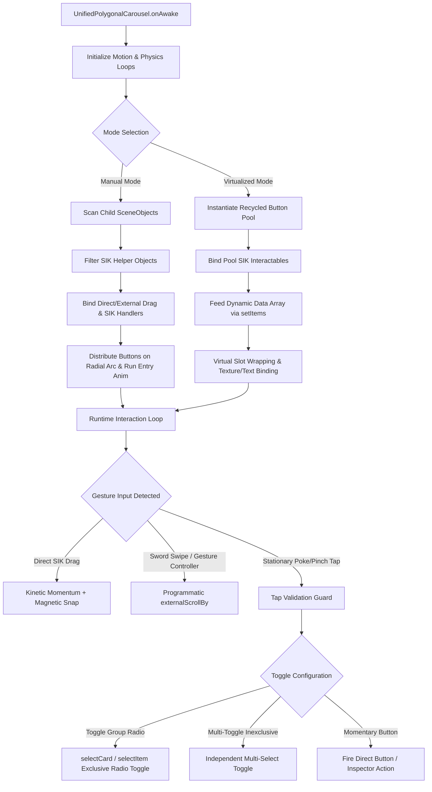

# UnifiedPolygonalCarousel System Guide & Complete Architectural Reference

The **UnifiedPolygonalCarousel** is the consolidated spatial UI carousel framework for **Snap Spectacles (2024)** and **Lens Studio 5.15+**. It merges the standalone manual carousel and virtualized carousel architectures into a single, high-performance, multi-mode component:

* **Manual Mode**: Distributes pre-authored child buttons (`PolygonalButton` or `BaseButton`) along a circular arc with individual inspector callbacks, custom per-button polygon shapes, and independent or radio-group toggle states.
* **Virtualized Mode**: Dynamically recycles a fixed pool of visual button templates across arbitrary or infinite datasets via `setItems()`, minimizing draw calls and memory overhead.

---

## ⚖️ Primary Use Case: When to Use Manual Mode vs. Virtualized Mode

| Feature | **Manual Mode** (`mode: "Manual"`) | **Virtualized Mode** (`mode: "Virtualized"`) |
| :--- | :--- | :--- |
| **Button Generation** | Operates directly on **pre-placed child SceneObjects** under `carouselRoot`. | Instantiates a recycled pool from a single **`cardPrefab` button template**. |
| **Dataset Size** | **Fixed, static button counts** (e.g. 5, 8, 12 buttons). | **Large, arbitrary, or streaming datasets** (e.g. 20, 50, 100+ items). |
| **Button Customization** | **Individual custom sizes, unique polygon shapes, or unique child layouts per button.** | All buttons share the template geometry; icons and texts are bound dynamically. |
| **Action Handling** | **Configured individually per button in Inspector** (or via `ManualCarouselDemoController`). | Injected programmatically via `CarouselItemData.onTap(isSelected)`. |
| **Draw-Call & Memory** | Each button has its own physical mesh and material in the scene. | **Fixed memory footprint**; recycles a tiny fixed pool (e.g. 7 physical buttons total). |
| **Toggle Memory** | Hardware state machine synchronized across child `BaseButton` instances. | Tracked via data index set (`toggledDataIndices`) and restored during slot recycling. |

---

### 🎠 Why Choose Manual Mode?

<p align="center">
  
  <br/>
  <em>Figure: Manual Mode distributing static child buttons with direct poke-and-drag physics and radio toggle selection.</em>
</p>

Use **Manual Mode** when you have a specific, fixed number of buttons (e.g. 12 features or 5 main app tabs) where each button requires:
* **Custom Inspector Callbacks**: Wiring distinct component events and sound effects directly in the Inspector.
* **Unique Geometry**: Hand-crafted polygon shapes, bespoke sizes, or distinct child hierarchies per button.
* **Static Scene Layout**: Buttons that live permanently in the hierarchy without dynamic code population.

---

### ⚡ Why Choose Virtualized Mode?

<p align="center">
  
  <br/>
  <em>Figure: Virtualized Mode template recycling driven by two-handed sword-swipe kinetic scrolling and native SIK pinch selection.</em>
</p>

Use **Virtualized Mode** when displaying large, arbitrary, or dynamic datasets (e.g. 39 apps, product catalogs, live feeds):
* **Draw-Call & Memory Bounds**: Instantiating 39+ heavy 3D button prefabs causes severe draw call overhead and frame drops on Spectacles. Virtualization creates only `slotCount` + `bufferSlots` (e.g. 5 + 2 = **7 physical buttons** total) and continuously recycles them as you scroll.
* **Infinite Data Support**: Display 10, 50, 100, or streaming items without changing scene hierarchy or increasing physical object counts.
* **Seamless Recycling**: Uses edge scaling & alpha fading (`fadeAtEdges`) so physical button recycling at the arc boundaries is completely invisible to the user.

---

## 🔷 Button Compatibility & SIK Parity

* **PolygonalButton Compatibility**: Fully optimized for child objects or prefabs containing `PolygonalButton` components. It automatically syncs button opacity, Z-pop displacement, procedural shape geometry, corner filleting, and state color transitions.
* **Spectacles UIKit / SIK Parity**: 100% compatible with standard rectangular Spectacles UIKit `BaseButton` prefabs or any custom script inheriting from `BaseButton` or exposing `isOn` and `opacity` properties.

---

## 📋 Inspector Inputs vs. Script API Mapping

| Inspector Section | Inspector Input Name | Script API Reference (TypeScript) | Type | Operational Notes |
| :--- | :--- | :--- | :--- | :--- |
| **Core Setup** | `mode` | `carousel.mode` | `"Manual" \| "Virtualized"` | Operational mode toggle |
| **Core Setup** | `cardPrefab` | `carousel.cardPrefab` | `ObjectPrefab` | Button template prefab (*Virtualized Mode only*) |
| **Core Setup** | `carouselRoot` | `carousel.carouselRoot` | `SceneObject` | Container translated/rotated to move carousel |
| **Core Setup** | `buttonScale` | `carousel.buttonScale` | `number` | Scale multiplier for buttons (default `1.0`) |
| **Core Setup** | `dataItemCount` | `carousel.dataItemCount` | `number` | Fallback item count (*Virtualized fallback*) |
| **Arc Layout** | `slotCount` | `carousel.setSlotCount(count)` | `number` | Number of visible button slots in the arc |
| **Arc Layout** | `bufferSlots` | `carousel.bufferSlots` | `number` | Extra off-screen slots allocated for smooth recycling |
| **Arc Layout** | `arcAngleDegrees` | `carousel.arcAngleDegrees` | `number` | Visible arc angle. Keep < 300° to prevent overlapping |
| **Arc Layout** | `arcOffsetDegrees` | `carousel.arcOffsetDegrees` | `number` | Rotates entire circle (0° = Top, 90° = Right, 180° = Bottom, 270° = Left) |
| **Arc Layout** | `slotOffset` | `carousel.slotOffset` | `number` | Shifts the starting button index along the circle (e.g. `-2`, `+1`) |
| **Arc Layout** | `radius` | `carousel.radius` | `number` | Radius in cm (~6cm for palm anchor, ~30cm for floating HUD) |
| **Arc Layout** | `alignRotationToCircle`| `carousel.alignRotationToCircle`| `boolean` | Must be `true` for radial alignment along the arc |
| **Arc Layout** | `layoutAxis` | `carousel.layoutAxis` | `"XY" \| "XZ" \| "YZ"` | **Recommended: "XY"**. Standard straight face-on circle |
| **Arc Layout** | `faceInward` | `carousel.faceInward` | `boolean` | Controls whether button faces point inward toward center |
| **Arc Layout** | `faceCamera` | `carousel.faceCamera` | `boolean` | Experimental billboarding toward camera |
| **Arc Layout** | `rotationOffset` | `carousel.rotationOffset` | `vec3` | Rotates button mesh orientation within slot (default `{0,0,90}`) |
| **Arc Layout** | `fadeAtEdges` | `carousel.fadeAtEdges` | `boolean` | Smooth scaling & alpha fading at arc boundaries |
| **Arc Layout** | `fadeRange` | `carousel.fadeRange` | `number` | Falloff distance for edge scaling and fading |
| **Touch & Physics** | `enableDirectDrag` | `carousel.enableDirectDrag` | `boolean` | Enable direct SIK hand ray/pinch/poke card dragging |
| **Touch & Physics** | `tapDragThreshold` | `carousel.tapDragThreshold` | `number` | Planar movement threshold in cm before tap becomes drag |
| **Touch & Physics** | `enableExternalDrag` | `carousel.enableExternalDrag` | `boolean` | Enable external gesture driver API (`externalScrollBy`) |
| **Touch & Physics** | `invertDrag` | `carousel.invertDrag` | `boolean` | Inverts touch drag direction (default `true`) |
| **Touch & Physics** | `dragSensitivity` | `carousel.dragSensitivity` | `number` | Sensitivity multiplier for touch dragging |
| **Touch & Physics** | `inertiaDamping` | `carousel.inertiaDamping` | `number` | Kinetic velocity decay rate after release |
| **Touch & Physics** | `snapSharpness` | `carousel.snapSharpness` | `number` | Magnetic slot snapping spring speed |
| **Touch & Physics** | `minVelocityToSnap` | `carousel.minVelocityToSnap` | `number` | Minimum velocity threshold before snapping engages |
| **Touch & Physics** | `maxDragVelocity` | `carousel.maxDragVelocity` | `number` | Clamp on maximum fling velocity |
| **Touch & Physics** | `enableToggleGroupBehavior`| `carousel.enableToggleGroupBehavior`| `boolean` | Exclusive radio-button toggle mode across buttons |
| **Touch & Physics** | `allowAllTogglesOff` | `carousel.allowAllTogglesOff` | `boolean` | Allows deselecting active button on second tap |
| **Touch & Physics** | `makeButtonsToggleable` | `carousel.makeButtonsToggleable` | `boolean` | Multi-select independent toggle mode (*Manual Mode*) |
| **Animations** | `enableEntryAnimation`| `carousel.playEntryAnimation()` | `void` | Triggers pop-in stagger animation |
| **Animations** | *(same toggle)* | `carousel.playExitAnimation()` | `void` | Triggers pop-out exit animation |
| **Animations** | `animateOnStart` | `carousel.animateOnStart` | `boolean` | `true` for dev preview; `false` for gesture-triggered lenses |
| **Animations** | `entryDuration` | `carousel.entryDuration` | `number` | Scale pop duration per button in seconds |
| **Animations** | `entryStaggerTime` | `carousel.entryStaggerTime` | `number` | Delay offset between adjacent button pops |
| **Animations** | `staggerDirection` | `carousel.staggerDirection` | `number` | `0` = Left-to-Right, `1` = Right-to-Left, `2` = Center Outward |

---

## 🔍 Detailed Section-by-Section Usage & Options Guide

### 1. Core Setup & Hierarchy
* **`mode`**: Choose between `"Manual"` (scans existing child SceneObjects under `carouselRoot`) and `"Virtualized"` (instantiates recycled templates from `cardPrefab`).
* **`carouselRoot`**: The parent `SceneObject` containing child buttons or recycled slots.
  > [!IMPORTANT]
  > **Architectural Anchor**: `carouselRoot` is the object you translate and rotate in scripts (e.g. anchoring to the user's palm via `HandMenuHelper` or `Carousel Fist GestureApp`). The carousel slot math calculates positions relative to `carouselRoot` so you can freely orient the menu anywhere in 3D space without breaking circular physics.
* **`buttonScale`**: Uniform scale multiplier applied to every button.

---

### 2. Arc & Circular Layout
* **`slotCount`**: The number of buttons visible concurrently within the active carousel arc (e.g. `5` or `6`).
* **`bufferSlots`**: Hidden off-screen slots allocated on both sides of the visible arc to ensure smooth wrapping during scrolling (e.g. `2` or `4`).
* **`arcAngleDegrees`**: Defines the total angle span of the carousel arc.
  > [!WARNING]
  > **360° Overlap Warning**: Setting `arcAngleDegrees` to `360` is NOT recommended because buttons will overlap! Keep `arcAngleDegrees` **less than 300°** (e.g. `180°` to `270°`) for a clean, non-overlapping circular arc.
* **`arcOffsetDegrees`**: Rotates the position of the entire circle in degrees:
  * `0°`: **12 o'clock (Top)**
  * `90°`: **3 o'clock (Right)**
  * `180°`: **6 o'clock (Bottom)**
  * `270°` / `-90°`: **9 o'clock (Left)**
* **`slotOffset`**: Integer offset that shifts which button starts at the primary angle without rotating the wheel geometry (`0` = default, `1` = shift forward by 1 slot, `-1` / `-2` = shift backward).
* **`radius`**: Distance from the carousel center in cm:
  * **~5.5 – 8.0 cm**: Ideal for tight hand/palm/fist-anchored menus.
  * **~20.0 – 35.0 cm**: Ideal for larger world-floating HUD menus.
* **`alignRotationToCircle`**: **MUST BE ENABLED (`true`)** to rotate each button radially along the circular path. If disabled, buttons spawn in circular positions but face flat without radial rotation.
* **`layoutAxis`**: Determines the 3D plane alignment of the circle (`XY`, `XZ`, `YZ`).
  * **Recommended: `"XY"`** — Renders a clean, face-on straight circle.
  * If selecting **`"XZ"` (horizontal flat table plane)** or **`"YZ"` (side profile plane)**, ensure your `rotationOffset` and parent orientation are adjusted to align with that plane.
* **`faceInward`**: Controls whether button faces point inward toward the circle center or outward.
* **`rotationOffset`**: Rotates the button mesh inside its slot (default `{0, 0, 90}`). Use this to align custom button orientation so they sit correctly along the arc.
* **`fadeAtEdges` & `fadeRange`**: Smoothly scales down and fades out button opacity toward the outer edges of the arc, making slot wrapping completely smooth and natural.

---

### 3. Touch Drag, Physics & Selection
* **`enableDirectDrag`**: Registers direct SIK hand ray/pinch/poke drag event listeners on each button so users can rotate the carousel directly by dragging button surfaces.
* **`tapDragThreshold`**: Tangential movement threshold in cm before a touch is classified as a drag rather than a stationary tap.
* **`enableExternalDrag`**: Enables external drag API methods (`externalScrollBy`, `externalDragStart`, `externalDragUpdate`, `externalDragEnd`) so external gesture controllers (e.g. `SwordSwipeScroller` or `Carousel Fist GestureApp`) can drive rotation.
* **`invertDrag`**: On (`true`) by default because pulling a physical ribbon feels natural. Disable if you want opposite touch direction.
* **`dragSensitivity` / `inertiaDamping` / `snapSharpness` / `minVelocityToSnap` / `maxDragVelocity`**: Tuning parameters for testing touch drag response, fling velocity, and magnetic slot snapping.
* **`enableToggleGroupBehavior`**: Enables exclusive radio-button selection mode across buttons (only 1 button active at a time).
* **`allowAllTogglesOff`**: When `true`, tapping an already-selected button toggles it off, returning to the neutral `"None Selected"` state.
* **`makeButtonsToggleable`**: Enables independent multi-select toggle mode where multiple buttons can be active simultaneously without forcing others off.

---

### 4. Stagger Animations & Development Workflow
* **`enableEntryAnimation`**: Enables staggered pop-in and pop-out scaling animations.
* **`animateOnStart`**:
  > [!TIP]
  > **Workflow Tip**: Keep `animateOnStart = true` while developing inside Lens Studio to preview the entry pop-in animation on start. **Uncheck `animateOnStart = false` for production deployment** so the carousel stays hidden on lens open until programmatically triggered by a hand gesture or script!
* **`entryDuration` / `entryStaggerTime`**: Controls pop-in scale duration and slot delay offset.
* **`staggerDirection`**:
  * `0`: **Left to Right** (Leftmost button pops first)
  * `1`: **Right to Left** (Rightmost button pops first)
  * `2`: **Center Outward** (Center button pops first, expanding outwards)

---

## 🎛️ Exact Production Inspector Presets

### 1. Manual Carousel Production Preset (Reference Scene: `Manual Carousel Set Size`)

Below are the exact production inspector values tuned for a 12-button front-facing circular HUD arc:

```yaml
# Manual Mode Production Configuration
Core Setup:
  Mode: "Manual"
  Carousel Root: [Assigned SceneObject or Empty for Self]

Button Scale: 1.00

Arc & Circular Layout:
  Slot Count: 6
  Buffer Slots: 4
  Arc Angle Degrees: 180.00
  Arc Offset Degrees: 90.00
  Slot Offset: -2
  Radius: 5.50
  Layout Axis: "XY Plane (Flat Face-On Circle)"
  Align Rotation To Circle: true
  Face Inward: true
  Face Camera: false
  Rotation Offset: (0.00, 0.00, 90.00)
  Fade At Edges: true
  Fade Range: 2.20

Touch Drag & Physics:
  Enable Direct Drag: true
  Tap Drag Threshold: 1.50
  Enable External Drag: false
  Invert Drag: true
  Drag Sensitivity: 0.05
  Inertia Damping: 4.50
  Snap Sharpness: 10.00
  Min Velocity To Snap: 0.015
  Max Drag Velocity: 1.50
  Enable Toggle Group Behavior: true
  Allow All Toggles Off: true
  Make Buttons Toggleable: false

Stagger Animations:
  Enable Entry Animation: true
  Animate On Start: true
  Entry Duration: 0.50
  Entry Stagger Time: 0.05
  Stagger Direction: "Center Outward"
```

---

### 2. Runtime Virtualized Carousel Production Preset (Reference Scene: `Runtime Carousel`)

Below are the production inspector values tuned for dynamic data-fed carousels with external sword-swipe scrolling:

```yaml
# Virtualized Mode Production Configuration
Core Setup:
  Mode: "Virtualized"
  Card Prefab: [PolygonalButton Prefab Asset]

Arc & Circular Layout:
  Slot Count: 5
  Buffer Slots: 2
  Arc Angle Degrees: 270.00
  Arc Offset Degrees: 135.00
  Slot Offset: 0
  Radius: 30.00
  Layout Axis: "XY Plane (Flat Face-On Circle)"
  Align Rotation To Circle: true
  Face Inward: false
  Face Camera: false
  Rotation Offset: (0.00, 0.00, 90.00)
  Fade At Edges: true
  Fade Range: 1.00

Touch Drag & Physics:
  Enable Direct Drag: true
  Tap Drag Threshold: 0.80
  Enable External Drag: true
  Invert Drag: true
  Drag Sensitivity: 0.05
  Inertia Damping: 4.50
  Snap Sharpness: 10.00
  Min Velocity To Snap: 0.015
  Max Drag Velocity: 1.50
  Enable Toggle Group Behavior: true
  Allow All Toggles Off: false
  Make Buttons Toggleable: false

Stagger Animations:
  Enable Entry Animation: true
  Animate On Start: true
  Entry Duration: 0.50
  Entry Stagger Time: 0.05
  Stagger Direction: "Left to Right"
```

---

## 💡 How the Demo & Populator Controllers Work

To help you build your own custom application controllers inspired by our sample scenes, here is an architectural breakdown of how both modes are utilized in code:

### 1. Manual Mode Controller: `ManualCarouselDemoController.ts`

In Manual Mode, buttons exist as real SceneObjects in the hierarchy. The `ManualCarouselDemoController` orchestrates selection feedback, central HUD display updates, and smooth alpha transitions:

* **Scene-Wide Auto-Discovery**: On `onStart()`, the controller automatically scans the scene hierarchy to locate the active `UnifiedPolygonalCarousel` and hooks into its `onItemSelected` event.
* **Unified Toggle Group vs. Multi-Toggle Handling**:
  * **Radio Toggle Group (`isToggleGroup = true`)**: Tapping a button selects that button (`selectCard(index)`), fades all unselected buttons to `dimmedAlpha` (`0.2`), and highlights the selected button (`1.0` alpha). If `allowAllTogglesOff` is enabled, tapping the active button deselects it (`selectCard(-1)`), resetting the HUD display to `"None Selected"`.
  * **Independent Multi-Toggle (`isMultiToggle = true`)**: Tapping buttons toggles each button's active state independently inside a `toggledIndices` set without forcing unselected buttons off.
* **Smooth Visual Lerping**: In `onUpdate()`, the controller lerps the alpha of each button's background texture and text smoothly toward its target alpha without stutter.

```typescript
// Example: Creating your own Manual Mode listener script
import { UnifiedPolygonalCarousel } from "./UnifiedPolygonalCarousel";

@component
export class CustomManualHUD extends BaseScriptComponent {
    @input carousel!: UnifiedPolygonalCarousel;
    @input statusText!: Text;

    onAwake(): void {
        this.createEvent("OnStartEvent").bind(() => {
            // Listen for carousel selection events
            this.carousel.onItemSelected = (index: number, buttonObj?: SceneObject) => {
                if (index === -1) {
                    this.statusText.text = "No Feature Selected";
                } else {
                    this.statusText.text = `Feature ${index + 1} Activated`;
                }
            };
        });
    }
}
```

---

### 2. Virtualized Mode Populator: `RuntimeCarouselExamplePopulator.ts`

In Virtualized Mode, only a small pool of visual buttons (e.g. 8 slots) is instantiated. The `RuntimeCarouselExamplePopulator` feeds an arbitrary list of data items into the carousel at runtime:

* **Dynamic Data Generation**: Creates an array of `CarouselItemData` objects containing `title`, `subtitle`, `texture`, and a custom `onTap(isSelected)` closure.
* **Per-Item Action Closure**: The `onTap` callback receives a boolean indicating whether the item is currently selected (`true`) or deselected (`false`), allowing individual items to trigger bespoke game or UI logic.
* **Data Injection**: Calls `carousel.setItems(customItems)`. The carousel automatically handles the math of mapping those items across the recycled visual buttons as the user scrolls.
* **Initial State Setup**: Queries `allowAllTogglesOff` on the carousel. If `false`, it auto-selects item `0` on startup; if `true`, it begins in the neutral `"None Selected"` state.

```typescript
// Example: Creating your own Virtualized Populator
import { UnifiedPolygonalCarousel, CarouselItemData } from "./UnifiedPolygonalCarousel";

@component
export class CustomAppLauncherPopulator extends BaseScriptComponent {
    @input carousel!: UnifiedPolygonalCarousel;
    @input appIcons!: Texture[];

    onAwake(): void {
        this.createEvent("OnStartEvent").bind(() => this.populateApps());
    }

    private populateApps(): void {
        const appList: CarouselItemData[] = [];
        for (let i = 0; i < 24; i++) {
            const appName = `Spatial App ${i + 1}`;
            appList.push({
                title: appName,
                subtitle: "Tap to launch",
                texture: this.appIcons[i % this.appIcons.length],
                onTap: (isSelected?: boolean) => {
                    if (isSelected) {
                        print(`Launching ${appName}...`);
                    }
                }
            });
        }
        this.carousel.setItems(appList);
    }
}
```

---

## 💻 Complete Public TypeScript API Reference

Access `UnifiedPolygonalCarousel` in script:
```typescript
const carousel = sceneObject.getComponent("Component.ScriptComponent") as UnifiedPolygonalCarousel;
```

### 1. Data Injection (`setItems`)

```typescript
export type CarouselItemData = {
    title: string;                          // Primary text header displayed on child Text
    subtitle?: string;                      // Optional subtitle string
    texture?: Texture;                      // Main background texture assigned to child Image
    icon?: Texture;                         // Optional icon texture assigned to child Image
    onTap?: (isSelected?: boolean) => void; // Callback triggered when item is tapped/toggled
};

// Inject dynamic items array (Virtualized Mode)
carousel.setItems(items);
```

---

### 2. Selection & Event Listening

```typescript
// Register selection listener (works for both Manual and Virtualized modes)
carousel.onItemSelected = (index: number, buttonObjOrItem?: any) => {
    if (index === -1) {
        // Deselected ("None Selected")
    } else {
        // Selected index
    }
};

// Programmatically select button at index 2
carousel.selectCard(2);

// Programmatically deselect all buttons
carousel.selectCard(-1);
```

---

### 3. Entry & Exit Animations

```typescript
// Trigger pop-in stagger animation (e.g. when fist gesture is detected)
carousel.playEntryAnimation();

// Trigger pop-out exit animation (e.g. when menu is closed)
carousel.playExitAnimation();
```

---

### 4. External Gesture Scroller API (`SwordSwipeScroller.ts`)

```typescript
// Scroll by delta angle (continuous rotation)
carousel.externalScrollBy(deltaAngle);

// Multi-step physics sequence
carousel.externalDragStart();
carousel.externalDragUpdate(dragAmount);
carousel.externalDragEnd(releaseVelocity);
```

---

### 5. Dynamic Slot Resizing & Rebuild

```typescript
// Dynamically adjust visible slot count
carousel.setSlotCount(7);

// Force hierarchy cleanup and layout recalculation
carousel.rebuild();
```

---

## 🚀 Spatial UX Design Recommendation: Two-Handed Interaction

> [!TIP]
> **Decoupling Scroll from Selection**:
> When building spatial interfaces for AR glasses, single-hand direct poke-and-scroll on small buttons can cause accidental selections upon release.
> 
> The recommended spatial interaction pattern is:
> 1. **Anchor / Spawn**: Left hand closed fist (`Carousel Fist GestureApp.ts`).
> 2. **Scroll Wheel**: Right hand 2-finger swipe across the arc (`SwordSwipeScroller.ts` calling `carousel.externalScrollBy()`).
> 3. **Select Button**: Native SIK pinch (direct targeting).
>
> This separation of scroll input from selection input guarantees 100% reliable interaction without touch conflict.

---

## 🛡️ Critical Architecture Safeguards

1. **Z-Depth Penetration Filter**:
   - Standard 3D distance calculations treat pressing into an AR button (Z-axis push of 1.5cm - 2.5cm) as a drag. `UnifiedPolygonalCarousel` uses planar tangential displacement ($\sqrt{\Delta x^2 + \Delta y^2}$) to guarantee stationary pokes are never discarded as drags.
2. **SIK State Machine Toggle Synchronization**:
   - Directly synchronizes UIKit `BaseButton` internal state machine (`_interactableStateMachine.toggle`) on every state change, preventing toggle state resurrection upon finger unhover.
3. **Pre-Tap Snapshot Selection**:
   - Captures `triggerStartSelectedIndex` on touch down (`onTriggerStart`) to differentiate between selecting an unselected button and double-tapping an already active button, preventing same-tap toggle deselect bugs.

---

## 🔬 Appendix: Technical Flow & Internal State Loop


