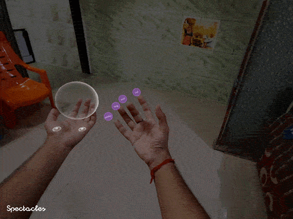

# Palm Menu Gesture System Guide & Complete Reference

The **Palm Menu Gesture System** is an experimental 4-finger multi-pinch gesture controller designed for Spectacles (2024). It extends beyond native SIK (which only supports Index-to-Thumb pinch) by tracking live thumb-to-fingertip proximity across **all four fingers** (Index, Middle, Ring, Pinky) to create quick-access spatial bookmarks anchored directly to your hand's finger joints.

<p align="center">
  
  <br/>
  <em>Figure: 4-finger multi-pinch palm bookmarking palette with fingertip proximity tracking and camera billboarding.</em>
</p>

---

## Experimental Vision & Concept

Native AR interaction frameworks typically limit voice or gesture menus to single pinch triggers. The Palm Menu system introduces a futuristic multi-finger bookmarking paradigm:

* **Spatial Bookmarks**: Turn your hand into an interactive tool palette. When your palm faces your eyes, each finger becomes an instant quick-action button!
* **Creative Tool Examples** (3D Painting / Sculpting Apps):
  * ☝️ **Index Finger**: `Undo` / `Redo` action
  * 🖕 **Middle Finger**: `Eraser Tool` toggle
  * 💍 **Ring Finger**: `Brush Palette` / `Color Picker` bookmark
  * 🤙 **Pinky Finger**: `Clear Canvas` / `Reset Workspace`
* **Palm-Facing Activation**: Menu buttons automatically stay hidden during ambient hand motion and pop into view with staggered entry animations only when your palm turns toward your face (`palmFacingThreshold`).
* **Futuristic Hardware Alignment**: As optical hand-tracking sensors become more precise in future glasses hardware generations, multi-finger knuckle gestures will feel even more instant and tactile.

---

## Joint Alignment & Proximity Dynamics

1. **Mid-Finger Joint Anchoring**: Buttons are dynamically anchored to the **Mid-Finger Joints (`index-1`, `mid-1`, `ring-1`, `pinky-1`)** of live SIK `HandVisual` skeleton assets (`indexMidJoint`, `middleMidJoint`, `ringMidJoint`, `pinkyMidJoint`).
2. **Thumb Proximity Tracking**: Computes real-time 3D distances between the active `thumbTip` and each fingertip (`indexTip`, `middleTip`, `ringTip`, `pinkyTip`).
3. **Dynamic Z-Displacement**: When a finger enters `hoverDistance` or triggers `selectDistance`, the corresponding button physically displaces upward along the hand's normal vector toward the user's camera (`pressZOffset`).
4. **Palm-Up Aligned Billboarding**: Calculates an orthogonal look-at frame facing the camera (`dirToCamera`) while locking its vertical axis strictly along the **palm's finger direction** (`wrist` $\rightarrow$ `middleKnuckle`). This guarantees buttons face the user without twisting or rolling when moving hands across the field of view.
5. **Facing Angle Hysteresis**: Uses a dynamic $+25^\circ$ hysteresis threshold when the menu is active, preventing the menu from collapsing when pinching the index finger or flexing the palm.

---

## Inspector Inputs vs. Script API Mapping

| Inspector Section | Inspector Input Name | Script API Reference (TypeScript) | Type | Notes |
| :--- | :--- | :--- | :--- | :--- |
| **Index Button** | `indexButton` | *(Inspector Reference)* | `ScriptComponent` | `PolygonalButton` script on Index finger |
| **Middle Button** | `middleButton` | *(Inspector Reference)* | `ScriptComponent` | `PolygonalButton` script on Middle finger |
| **Ring Button** | `ringButton` | *(Inspector Reference)* | `ScriptComponent` | `PolygonalButton` script on Ring finger |
| **Pinky Button** | `pinkyButton` | *(Inspector Reference)* | `ScriptComponent` | `PolygonalButton` script on Pinky finger |
| **Right Hand Visual** | `rightHandVisual` | *(Inspector Reference)* | `ScriptComponent` | SIK Right `HandVisual` scene component |
| **Left Hand Visual** | `leftHandVisual` | *(Inspector Reference)* | `ScriptComponent` | SIK Left `HandVisual` scene component |
| **Target Hand** | `targetHand` | *(Inspector Only)* | `number` | Right Only (0), Left Only (1), Both Hands (2) |
| **Facing Angle** | `palmFacingThreshold` | *(Inspector Only)* | `number` | Angle in degrees to trigger menu display (~65°) |
| **Facing Axis** | `cameraFacingAxis` | *(Inspector Only)* | `vec3` | Local front-facing axis on button to face camera (`{0,0,1}`) |
| **Button Up Axis** | `buttonUpAxis` | *(Inspector Only)* | `vec3` | Local top/up axis on button to point along fingers (`{0,1,0}`) |
| **Hover Distance** | `hoverDistance` | *(Inspector Only)* | `number` | Thumb-to-fingertip hover threshold in cm (~5cm) |
| **Select Distance** | `selectDistance` | *(Inspector Only)* | `number` | Thumb-to-fingertip trigger threshold in cm (~2cm) |
| **Press Z Offset** | `pressZOffset` | *(Inspector Only)* | `number` | Upward Z displacement in cm on hover/press |
| **Select Cooldown** | `selectCooldown` | *(Inspector Only)* | `number` | Delay in seconds between successive triggers |
| **Toggle Mode** | `enableToggleBehavior` | *(Inspector Only)* | `boolean` | Exclusive radio-button mode across fingers |
| **Allow All Off** | `allowAllTogglesOff` | *(Inspector Only)* | `boolean` | Allows deselecting active finger on second tap |
| **Selected Index** | *(State)* | `app.getSelectedIndex()` | `number` | Currently selected finger index (0-3 or -1) |
| **Selected Name** | *(State)* | `app.getSelectedFingerName()` | `string` | "Index", "Middle", "Ring", "Pinky", "None" |

---

## Detailed Section-by-Section Usage & Options Guide

### 1. Finger Button Objects (4 Items)
* **`indexButton` / `middleButton` / `ringButton` / `pinkyButton`**: Drag `PolygonalButton` script components attached to your 4 button SceneObjects. Each button is assigned to its respective finger.

### 2. SIK Hand Visuals & Camera
* **`rightHandVisual` / `leftHandVisual`**:
  > [!IMPORTANT]
  > **Required Setup**: You MUST drag the `HandVisual` components from your SIK HandVisuals in the Scene Hierarchy into these fields. `PalmMenuGestureApp` uses `HandVisual.indexMidJoint`, `middleMidJoint`, `ringMidJoint`, and `pinkyMidJoint` to position buttons directly on finger bones!
* **`worldCamera`**: Drag your main camera here for billboarding calculation (defaults to scene camera if unassigned).

### 3. Hand Selection & Facing Trigger
* **`targetHand`**: Choose `Right Hand Only` (0), `Left Hand Only` (1), or `Both Hands (Follow Active)` (2).
* **`palmFacingThreshold`**: Camera facing threshold in degrees (default `65.0`°). When palm-to-camera angle is less than this threshold, the menu becomes visible; when palm turns away, buttons automatically hide.

### 4. Active Finger Enables
* **`enableIndexFinger` / `enableMiddleFinger` / `enableRingFinger` / `enablePinkyFinger`**: Checkboxes allowing you to selectively enable or disable individual fingers (e.g. disable Pinky if you only want 3 buttons).

### 5. Button Offsets & Billboarding
* **`positionOffset`**: 3D position offset relative to each finger bone joint.
* **`rotationOffset`**: 3D rotation offset in degrees.
* **`cameraFacingAxis`**: Local axis vector that points toward the camera during billboarding (default `{0, 1, 0}`).
* **`buttonScale`**: Scale multiplier applied to all 4 finger buttons.

### 6. Thumb Proximity & Press Thresholds
* **`hoverDistance`**: Distance in cm between thumb tip and target fingertip to enter `Hover` state (default `5.0` cm).
* **`selectDistance`**: Distance in cm between thumb tip and target fingertip to trigger `Select` action (default `2.0` cm).
* **`pressZOffset`**: Upward displacement in cm along hand normal vector when hovered/pressed (default `0.8` cm).
* **`selectCooldown`**: Cooldown time in seconds between successive triggers to prevent accidental double-taps (default `0.4`s).

### 7. Toggle Group Behavior
* **`enableToggleBehavior`**: When `true`, buttons act as an exclusive radio-button group (only 1 finger active at a time).
* **`allowAllTogglesOff`**: When `true`, tapping the active finger again deselects it, leaving no fingers toggled.

### 8. Entry Animations
* **`enableEntryAnimation`**: Enables bouncy pop-in scaling and opacity fade when palm turns toward the user.
* **`entryDuration` / `entryStaggerTime`**: Controls pop-in scale duration (`0.35`s) and finger-to-finger delay offset (`0.05`s).

---

## External Controller Scripts (`PalmMenuController` & `PalmMenuMaterialController`)

You can hook external scripts into `PalmMenuGestureApp` event callbacks to drive custom application logic:

### 1. `PalmMenuController.ts` (Action & Audio Event Binding)
Binds to `onButtonSelected` and `onSelectionChanged` to play audio sound effects, update debug UI text, or trigger app commands when specific fingers are pinched.

```typescript
const palmApp = sceneObject.getComponent("Component.ScriptComponent") as PalmMenuGestureApp;

// Subscribe to button selection callback
palmApp.onButtonSelected.push((fingerIndex, fingerName, button) => {
  print("Finger Pinched: " + fingerName + " (Index: " + fingerIndex + ")");
  if (fingerIndex === 0) {
    // Index finger -> Undo Action
  } else if (fingerIndex === 1) {
    // Middle finger -> Eraser Tool
  }
});
```

### 2. `PalmMenuMaterialController.ts` (Material & Color Manipulation)
Binds to `onSelectionChanged` to swap materials, textures, or base colors on 3D target models when fingers are toggled.

---

## Complete Public API Reference (Script Access)

Access `PalmMenuGestureApp` via:
`const app = sceneObject.getComponent("Component.ScriptComponent") as PalmMenuGestureApp;`

### 1. Query Selected Finger State

```typescript
// Returns currently selected finger index: 0=Index, 1=Middle, 2=Ring, 3=Pinky, -1=None
const selectedIdx: number = app.getSelectedIndex();

// Returns selected finger name: "Index", "Middle", "Ring", "Pinky", or "None"
const fingerName: string = app.getSelectedFingerName();
```

### 2. Event Callbacks

```typescript
// Triggered when a finger is pinched/selected
app.onButtonSelected.push((fingerIndex: number, fingerName: string, button?: ScriptComponent) => {
  // Execute custom action
});

// Triggered when a finger enters hover proximity
app.onButtonHovered.push((fingerIndex: number, fingerName: string, button?: ScriptComponent) => {
  // Play subtle hover tick sound
});

// Triggered when toggle state changes
app.onSelectionChanged.push((selectedIndex: number, fingerName: string, isToggledOn: boolean) => {
  // Update global tool mode
});
```
