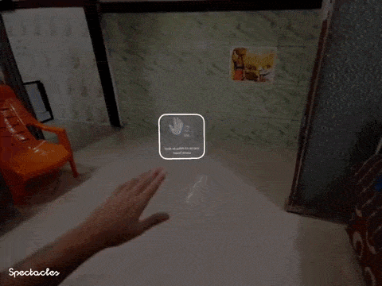

# 🔍 Futuristic UI v1 — Detailed Feature Overview

This document provides an in-depth technical breakdown of every component, interaction controller, and helper utility in **Futuristic UI v1** for Snap Spectacles (2024).

For dedicated API parameters and configuration guides for individual systems, refer to the guides linked in each section below.

---

## 1. 🔷 Polygonal Button System (`PolygonalButton.ts`)
📖 *Full System Guide: [`POLYGONAL_BUTTON_SYSTEM.md`](Assets/Futuristic%20UI%20v1%20Assets/Polygonal%20Button/POLYGONAL_BUTTON_SYSTEM.md)*

  
   
  <em>Figure 1: Procedural polygon geometry, corner filleting, border outlines, and nested text/image child layouts.</em>

`PolygonalButton` is a procedural 2D polygon button generator that directly extends Spectacles UIKit's `BaseButton` and integrates with SIK's `Interactable` system.

### Core Capabilities:
* **Procedural 2D Geometry**: Generates planar polygon meshes at runtime using Lens Studio's `MeshBuilder`. Choose from built-in presets (`Pentagon`, `Chevron`, `Trapezoid`, `Hexagon`, `Octagon`) or supply custom 2D vertex arrays.
* **Corner Rounding & Tessellation**: `cornerRadius` (e.g. `0.2` – `0.5`) creates smooth fillets on polygon vertices, and `cornerSegments` controls curve subdivision detail.
* **Border Ribbons**: Configurable `borderWidth` creates an outer highlight outline ribbon around the button perimeter.
* **6-State Dynamic Color Engine**: Configurable color properties for:
  - `Default` (Normal resting state)
  - `Highlight` (Hovered by ray or poke cursor)
  - `Select` (Triggered on pinch or push)
  - `Toggled` (Active radio toggle state)
  - `Toggled Hover` / `Toggled Select`
  - `Disabled` (Non-interactive)
* **Alpha Propagation**: Modifying `buttonOpacity` automatically updates the alpha channel across all nested child images (`Component.Image`) and text renderers (`Component.Text` / `Text3D`).
* **Micro-Animations**: Choose between `Scale` (subtle compression on press), `Position` (Z-pop forward on hover/select), `Both`, or `None`.

---

## 2. 🌟 Unified Polygonal Carousel (`UnifiedPolygonalCarousel.ts`)
📖 *Full System Guide: [`UNIFIED_CAROUSEL_SYSTEM.md`](Assets/Futuristic%20UI%20v1%20Assets/Carousels/Unified%20Polygonal%20Carousel/UNIFIED_CAROUSEL_SYSTEM.md)*

The `UnifiedPolygonalCarousel` merges manual button arrangements and virtualized template recycling into a single high-performance component with kinetic momentum, magnetic snapping, and two operational modes:

### Dual Operational Modes:

#### A. Manual Mode (`mode: "Manual"`)

  
   
  <em>Figure 2: Manual Mode circular layout distributing child buttons with poke-and-drag physics and radio toggle states.</em>

* Automatically distributes pre-placed child buttons ($N = 3, 4, 8, 12...$) along a circular arc.
* Ideal for static button sets with custom polygon shapes, unique dimensions, or bespoke Inspector callbacks per button.
* Supports exclusive radio-group toggles (`enableToggleGroupBehavior`) or independent multi-select toggles (`makeButtonsToggleable`).

#### B. Virtualized Mode (`mode: "Virtualized"`)

  
   
  <em>Figure 3: Virtualized Mode template recycling driven by two-handed sword-swipe kinetic scrolling and native SIK pinch selection.</em>

* Dynamically recycles a lightweight physical pool (e.g. 7 buttons) from a single `cardPrefab` template.
* Scales to arbitrary, large, or streaming datasets (e.g. 20, 50, 100+ items) via `carousel.setItems(items)` with zero memory bloat or draw-call spikes.
* Injects per-item `onTap(isSelected)` callback closures to trigger custom application logic.

### Universal Physics & Layout Features:
* **Planar Face-On Arc (`layoutAxis = "XY"`)**: Evenly distributes buttons along a vertical circular arc with configurable radius (~6cm for palm anchor, ~30cm for world HUD).
* **Kinetic Physics**: Direct SIK poke/drag interaction, smooth inertia damping after release, and magnetic slot snapping.
* **External Scroller Support**: Exposes `externalScrollBy`, `externalDragStart`, `externalDragUpdate`, and `externalDragEnd` for gesture drivers like `SwordSwipeScroller.ts`.
* **Smooth Edge Fading**: Scales and fades buttons at arc boundaries (`fadeAtEdges`) for seamless slot wrapping.

---

## 3. ⚔️ 2-Handed Spatial Gesture Controllers
📖 *Full System Guide: [`GESTURE_SCROLLER_SYSTEM.md`](Assets/Futuristic%20UI%20v1%20Assets/Carousels/Gesture%20Controllers/GESTURE_SCROLLER_SYSTEM.md)*

### A. Fist Anchor Spawner (`Carousel Fist GestureApp.ts`)
* **Fist Spawning**: Form and hold a closed fist (`gestureHoldTime ≈ 0.5s`) to spawn the carousel anchored to your hand.
* **Fused Detection Pipeline**: Combines Snap's native `GestureModule` Grab ML classifier (`getGrabBeginEvent` / `getGrabEndEvent`) with continuous Euclidean bone distance checks (`wrist` $\rightarrow$ `indexKnuckle` / `fingertip`), eliminating tracking dropouts.
* **Staggered Animations**: Smooth pop-in on fist hold, and sequential card fade-out when opening the hand.

### B. Sword-Swipe Kinetic Scroller (`SwordSwipeScroller.ts`)
* **2-Finger Sword Gesture**: Form a 2-finger "sword" pose with your opposite hand and roll/swipe around the carousel's outer ring.
* **Virtual Cylinder Mapping**: Projects the hand onto an invisible cylindrical shell surrounding the carousel to convert 3D hand velocity into rotational scroll momentum.
* **SIK Pinch Compatibility**: Preserves standard SIK pinch targeting so you can swipe with two fingers and pinch to select items simultaneously without touch conflicts.

---

## 4. 🖐️ Stabilized Hand Menu Helper (`HandMenuHelper.ts`)
📖 *Full System Guide: [`HAND_MENU_HELPER_SYSTEM.md`](Assets/Futuristic%20UI%20v1%20Assets/Hand%20Menu/HAND_MENU_HELPER_SYSTEM.md)*

  
   
  <em>Figure 4: Knuckle-derived stabilized coordinate frame with outward edge projection and Desktop Preview Simulator integration.</em>

### Core Capabilities:
* **Knuckle-Derived Stabilized Frame**: Computes a stable palm coordinate frame from multiple knuckle tracking points (`mid-0`, `index-0`, `pinky-0`, `wrist`), eliminating jitter from individual finger twitches.
* **Edge-Origin Pivot Layout**: Placing the local origin `(0,0,0)` at the outer edge of the menu causes the panel to project cleanly outward alongside the palm.
* **Desktop Preview Simulator (`HandPreviewSimulator.ts`)**:
  - Bundles 3D reference hand models directly into the Lens Studio desktop preview.
  - Check **`Debug Preview Simulator`** on `HandMenuHelper` and enable `HandPreviewSimulator` to test position offsets, rotation angles, and facing thresholds without deploying to hardware.

---

## 5. ✨ 4-Finger Multi-Pinch Palm Menu (`PalmMenuGestureApp.ts`)
📖 *Full System Guide: [`PALM_MENU_GESTURE_SYSTEM.md`](Assets/Futuristic%20UI%20v1%20Assets/Palm%20Menu/PALM_MENU_GESTURE_SYSTEM.md)*

  
   
  <em>Figure 5: 4-finger multi-pinch tool bookmarking palette with fingertip proximity tracking and camera billboarding.</em>

### Core Capabilities:
* **Multi-Pinch Shortcuts**: Tracks 3D thumb proximity to 4 individual fingertips (Index, Middle, Ring, Pinky), turning the hand into a 4-slot quick-access bookmarking palette.
* **Knuckle Anchoring**: Buttons anchor to mid-knuckles (`index-1`, `mid-1`, `ring-1`, `pinky-1`) and project outward along the finger axis, remaining stable while appearing perched near fingertips.
* **Palm-Up Billboarding**: Uses an orthogonal dual-basis look-at transform that billboards buttons toward the camera (`dirToCamera`) while locking their vertical axis strictly along the **palm's finger direction** (`wrist` $\rightarrow$ `middleKnuckle`).
* **Hysteresis Facing Gate**: Opens when palm faces the eyes (`palmFacingThreshold ≈ 65°`) and applies a dynamic $+25^\circ$ hysteresis buffer while active to prevent accidental menu closing during pinch motions.

---

## 6. 🎬 Video Tutorial HUDs & Hint Controllers

### Core Capabilities:
* **Modular HUD Construction**: Pre-built hierarchy pattern:
  `Parent Tether / Root` $\rightarrow$ `Container Plate (PolygonalButton)` $\rightarrow$ `Image (Video Texture Provider)`.
* **Head-Vision Tethering (`UniversalCameraFollowerTS.ts`)**: Combines distance thresholds and angular deadzone cones to keep the tutorial HUD floating comfortably within the user's field of view without rigidly sticking to head turns.
* **Speed-Compensated Looping (`Video Player Controller Script.ts`)**: Plays video textures with custom playback speeds (`1.5x`, `2.0x`) and includes an `UpdateEvent` loop watcher to prevent trailing freeze frames.
* **Timed Opacity Animation (`PolygonalButtonHintController.ts`)**: Controls automatic fade-in on start (`startDelay`), hold duration (`afterInDelay`), and fade-out (`outDuration`).
