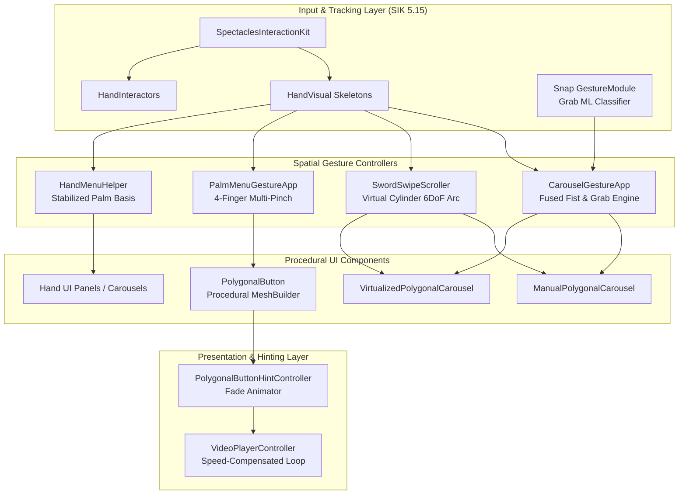

# 🚀 Futuristic UI v1 (Lens Studio 5.15+)

An open-source spatial UI framework designed for **Snapdragon-powered Spectacles (2024)** and **Lens Studio 5.15+**.

This project provides procedural polygonal geometry generation, dual 3D carousel architectures (Handcrafted Manual & Dynamic Virtualized), multi-modal 6DoF gesture controllers (Fist-Anchored Spawning, Kinetic Sword-Swipe Momentum), a 4-finger multi-pinch Palm Menu bookmarking system, a stabilized Hand Menu layout helper with a desktop preview simulator, and procedural video tutorial HUD containers.

---

## 📚 System Documentation Index

Each sub-system includes a dedicated, deep-dive architectural and API guide:

| Sub-System | Guide Path | Core Purpose |
| :--- | :--- | :--- |
| **🔷 Polygonal Button System** | [`POLYGONAL_BUTTON_SYSTEM.md`](Assets/Futuristic%20UI%20v1%20Assets/Polygonal%20Button/POLYGONAL_BUTTON_SYSTEM.md) | Procedural 2D polygon generation, corner rounding, border ribbons, dynamic color states, and hint controllers. |
| **🎡 Manual Carousel System** | [`MANUAL_CAROUSEL_SYSTEM.md`](Assets/Futuristic%20UI%20v1%20Assets/Carousels/Manual%20Carousel/MANUAL_CAROUSEL_SYSTEM.md) | Handcrafted multi-card carousel with automatic circular distribution, kinetic momentum, and slot snapping. |
| **⚡ Virtualized Runtime Carousel** | [`VIRTUALIZED_CAROUSEL_SYSTEM.md`](Assets/Futuristic%20UI%20v1%20Assets/Carousels/Runtime%20Virtualized%20Carousel/VIRTUALIZED_CAROUSEL_SYSTEM.md) | Script-driven virtualized carousel with memory pooling, dynamic data population, and infinite wrapping. |
| **⚔️ Gesture Scroller & Fist System** | [`GESTURE_SCROLLER_SYSTEM.md`](Assets/Futuristic%20UI%20v1%20Assets/Carousels/GESTURE_SCROLLER_SYSTEM.md) | Fist-hold spatial anchoring (`CarouselGestureApp`) and 6DoF circular Sword-Swipe kinetic flinging (`SwordSwipeScroller`). |
| **🖐️ Hand Menu Helper & Simulator** | [`HAND_MENU_HELPER_SYSTEM.md`](Assets/Futuristic%20UI%20v1%20Assets/Hand%20Menu/HAND_MENU_HELPER_SYSTEM.md) | Anti-jitter stabilized palm coordinate frame, edge-origin layout, and desktop preview simulator workflow. |
| **✨ Palm Menu Gesture System** | [`PALM_MENU_GESTURE_SYSTEM.md`](Assets/Futuristic%20UI%20v1%20Assets/Palm%20Menu/PALM_MENU_GESTURE_SYSTEM.md) | 4-finger multi-pinch tool bookmarking (Index, Middle, Ring, Pinky) anchored to finger joints. |

---

## 🏗️ Master Scene Hierarchy Guide (`Scene.scene`)

When you open `Scene.scene` in Lens Studio, the hierarchy is organized into clearly labeled top-level sample roots. You can test each system individually by enabling one sample root at a time while keeping camera, lighting, and SIK enabled:

```
Scene Hierarchy
├── 📷 Camera Object (Main Camera + Default 3D Hands)
├── 💡 Lighting (Ambient Light + Directional Light)
├── 👓 SpectaclesInteractionKit ([REQUIRED] Core Interactors & Visuals)
├── 📦 PolygonalButton [Base template prefab]
│
├── 🔘 Buttons Frame [Button shape & style examples]
├── 🎡 Carousel Samples [Manual, Virtualized, and Simple Circle]
│   ├── 🎠 Manual Carousel
│   ├── ⚡ Runtime Carousel
│   └── ⭕ Simple Circle Polygonal Carousel
├── 🖐️ Palm Menu [4-finger multi-pinch example]
├── 📐 Hand Menu Sample [Stabilized palm panel helper]
└── 🎬 HINT VISUALS [6 pre-configured video tutorial HUD cards]
```

---

## 🔍 Detailed Walkthrough by Sample Section

### 1. `Buttons Frame [DIFFERENT BUTTON EXAMPLES]`
* **Hierarchy Structure**:
  * Contains 10 pre-configured button variants (`buttons can have text child`, `different shape presets`, `use textures`, `fit to size`, `animation type defaults`, etc.).
  * Each button is a `SceneObject` with a `PolygonalButton.ts` script component and optional child `Text`, `Text3D`, or `Image` components.
* **Key Capabilities**:
  * **Shape Presets**: Toggle between `Pentagon` (0), `Chevron` (1), `Trapezoid` (2), `Hexagon` (3), `Octagon` (4), or `Custom` (5).
  * **Geometry Tuning**: Adjust `cornerRadius`, `cornerSegments` (tessellation detail), and `borderWidth` (outer ribbon border thickness).
  * **Dynamic Color States**: Full public getter/setter properties for `Default`, `Highlight` (Hover), `Select` (Triggered), `Toggled`, and `Disabled` states.
  * **Automatic Alpha Syncing**: Adjusting `buttonOpacity` automatically propagates transparency to all child image textures and text renderers.
  * **Animation Types**: Select between `Scale` (scale down on press), `Position` (Z-pop out on hover/press), `Both`, or `None`.
* **Workflow**: Duplicate `PolygonalButton`, rename it, adjust inspector properties, add child visuals, and drag it into your project folder to create a reusable prefab.

---

### 2. `Carousel Samples [TRY CAROUSELS]`

#### A. Manual Carousel (`Manual Carousel`)
* **Core Script**: `ManualPolygonalCarousel.ts` attached to `ManualPolygonalCarousel Set Size`.
* **Auto-Circular Layout**:
  * Under `Manual Carousel Root`, there are 12 `PolygonalButton` children (`PolygonalButton 1` to `12`).
  * Place child buttons anywhere; when the Lens starts, `ManualPolygonalCarousel` automatically spaces and rotates all child buttons evenly along a circle of radius `radius` in the **XY plane** (vertical face-on orientation, the primary stable layout axis).
  * **Circle Placement & Offsets**: Use **`arcOffsetDegrees`** to rotate the wheel's orientation (0° = Top/12 o'clock, 90° = Right/3 o'clock, 180° = Bottom/6 o'clock, 270° = Left/9 o'clock) and **`slotOffset`** to shift which button index starts at the primary angle.
  * **Radio-Button Toggling**: Built-in exclusive single-selection mode (`enableToggleBehavior`) with optional deselect (`allowAllTogglesOff`) using event-driven `BaseButton.onFinished` sync.
* **Demo Controller (`ManualCarouselDemoController.ts`)**:
  * Demonstrates how individual button clicks in the carousel trigger application events (e.g. selecting zodiac cards in `Zod Root`).

#### B. Runtime Carousel (`Runtime Carousel`)
* **Core Script**: `VirtualizedPolygonalCarousel.ts` attached to `Runtime PolygonalCarousel Unset Size`.
* **Virtualization & Pooling**:
  * Generates 3D button slots dynamically at runtime via script without placing individual button objects in the scene hierarchy.
  * Dynamically maps large data sets (e.g. 50+ items) across a fixed pool of visual slots (e.g. 8 visible slots) with seamless infinite wrapping.
  * Uses cached data recycling (`_lastDataIndex`) to ensure smooth scrolling without interrupting active SIK hover or trigger states.
* **Populator Application (`RuntimeCarouselExamplePopulator.ts`)**:
  * Demonstrates how an external script supplies data items, assigns icon textures and text labels, and subscribes to card selection callbacks.
* **Gesture Controller Integration (`Carousel Controller`)**:
  * `CarouselGestureApp.ts`: Anchors the carousel to a held fist gesture (`gestureHoldTime = 0.5s`), translates with fist movement, and plays exit stagger animations when the hand opens. Uses a fused dual-detection engine combining Snap's native `GestureModule` Grab ML classifier with continuous joint distance tracking.
  * `SwordSwipeScroller.ts`: Tracks circular 2-finger "Sword Finger" slashing gestures in the carousel plane to fling the carousel with kinetic momentum.
  * **Drag Mode Toggles**: Test `enableDirectDrag` (direct SIK ray/pinch dragging on cards) vs. `enableExternalDrag` (remote gesture/sword scroller input) independently.

#### C. Simple Circle Polygonal Carousel (`Simple Circle Polygonal Carousel`)
* A lightweight static circular radial layout without kinetic drag physics, ideal for fixed circular HUD status dials or static radial tool selectors.

---

### 3. `Palm Menu [4-Finger Multi-Pinch]`
* **Core Scripts**:
  * `PalmMenuGestureApp.ts`: Tracks live 3D thumb-to-fingertip proximity across all 4 fingers (Index, Middle, Ring, Pinky).
  * `PalmMenuController.ts` / `PalmMenuMaterialController.ts`: Sample application controller that maps finger pinches to tool actions (e.g. switching sphere materials or tool modes).
* **Knuckle-Anchoring with Fingertip Offsets**:
  * Buttons (`PolygonalButton 1` to `4`) are dynamically anchored to the **Mid-Finger Knuckles (`index-1`, `mid-1`, `ring-1`, `pinky-1`)** and offset outward along the finger bone axis.
  * Anchoring to mid-knuckles and projecting outward keeps buttons stable while appearing visually perched at the fingertips.
* **Palm-Up Aligned Billboarding**:
  * Computes an orthogonal look-at frame facing the camera (`dirToCamera`) while locking its vertical axis strictly along the **palm's finger direction** (`wrist` $\rightarrow$ `middleKnuckle`).
  * Features configurable **`cameraFacingAxis`** and **`buttonUpAxis`** inputs for custom mesh alignment.
* **Palm-Facing Trigger & Hysteresis**:
  * Stays hidden during natural hand movement and pops into view when your palm faces your eyes (`palmFacingThreshold ≈ 65°`).
  * Uses a dynamic $+25^\circ$ hysteresis threshold while active, preventing the menu from collapsing when pinching the index finger or flexing the palm.

---

### 4. `Hand Menu Sample [Stabilized Palm Panel Helper]`
* **Core Script**: `HandMenuHelper.ts` attached to `HandMenuHelper`.
* **Anti-Jitter Palm Frame**:
  * Calculates a stabilized palm coordinate frame from multiple knuckle points (`mid-0`, `index-0`, `pinky-0`, `wrist`), isolating menu transforms from finger twitches.
* **Edge-Origin Pivot Principle**:
  * Offsetting the menu root's local origin `(0,0,0)` to the outer edge of the menu causes the menu to cleanly project outward alongside the palm.
* **Desktop Preview Simulator (`HandPreviewSimulator.ts`)**:
  * A bundled hand rig prefab that simulates left and right hands in the Lens Studio desktop preview.
  * Check **`Debug Preview Simulator`** on `HandMenuHelper` and enable `HandPreviewSimulator` to test menu placement, rotation offsets, and palm facing thresholds directly in desktop preview without needing hardware.

---

### 5. `HINT VISUALS` & Video Controller
* **Hierarchy Structure**:
  * Contains 6 pre-configured hint prefabs: `[HINT] Palm Menu Hint Visual`, `[HINT] Hand Menu Palm Open Visual`, `[HINT] Fist Gesture Carousel In Out Visual`, `[HINT] Fist Gesture Carousel In Visual`, `[HINT] Carousel Sword Scrolling and Pinch Visual`, and `[HINT] Carousel Poke Scrolling and Selection`.
* **Video Player Controller (`Video Player Controller Script.ts`)**:
  * Plays video textures (`VideoTextureProvider`) with custom playback speeds (`playbackRate = 1.5x`, `2.0x`).
  * Features a speed-compensated frame loop watcher in `UpdateEvent` that prevents trailing freeze frames when looping at non-standard speeds.
* **PolygonalButton as an Inactive Hint Container**:
  * Shows how `PolygonalButton` can be used as a themed, semi-transparent HUD backdrop plate paired with `PolygonalButtonHintController.ts` for automatic fade-in on start (`startDelay`), hold duration (`afterInDelay`), and fade-out (`outDuration`).

---

## ⚙️ Recommended Tuning & Parameters Matrix

| Component | Key Parameter | Recommended Value | Description |
| :--- | :--- | :--- | :--- |
| **`PolygonalButton`** | `cornerRadius` | `2.0` – `5.0` cm | Smoothness of polygon corner arcs |
| | `borderWidth` | `0.3` – `0.8` cm | Outer highlight ribbon thickness |
| | `popDistance` | `1.5` – `3.0` cm | Forward Z displacement during hover / select |
| **`ManualPolygonalCarousel`** | `radius` | `25.0` – `35.0` cm | Wheel radius for floating UI (~6.0 cm for hand-held) |
| | `arcAngleDegrees` | `180°` – `270°` | Total arc span (< 300° prevents overlap) |
| | `arcOffsetDegrees` | `0°` (Top), `90°` (Right) | Orientation of starting slot along circle |
| | `slotOffset` | `0`, `1`, `2`... | Shift starting button index |
| | `inertiaDamping` | `4.0` – `8.0` | Kinetic friction decay rate after swipe release |
| | `snapSharpness` | `12.0` – `18.0` | Magnetic snap responsiveness to nearest slot |
| **`VirtualizedPolygonalCarousel`** | `slotCount` | `5` – `9` | Number of concurrent visible cards in arc |
| | `bufferSlots` | `2` – `4` | Extra off-screen slots allocated for invisible recycling |
| | `buttonScale` | `0.8` – `1.2` | Scale multiplier for pooled card instances |
| **`CarouselGestureApp`** | `gestureHoldTime` | `0.4` – `0.6` s | Continuous fist duration before spawning |
| | `fistDistanceThreshold`| `8.0` – `12.0` cm | Index-tip to wrist distance for closed fist |
| | `useNativeGrab` | `true` | Fused native Snap `GestureModule` Grab ML classifier |
| | `positionSmoothing` | `8.0` – `14.0` | Smoothing rate for hand translation tracking |
| **`SwordSwipeScroller`** | `engageMargin` | `8.0` – `15.0` cm | Radial ring thickness for virtual cylinder engagement |
| | `depthMargin` | `6.0` – `10.0` cm | Depth plane tolerance in front/behind carousel |
| | `scrollMultiplier` | `0.8` – `1.5` | Angular swipe to carousel scroll velocity gain |
| **`PalmMenuGestureApp`** | `palmFacingThreshold` | `55°` – `70°` | Palm angle to camera before menu appears |
| | `hoverDistance` | `4.0` – `6.0` cm | Thumb-to-fingertip proximity for hover state |
| | `selectDistance` | `1.8` – `2.5` cm | Thumb-to-fingertip contact threshold for click |
| | `pressZOffset` | `0.5` – `1.2` cm | Tactile forward Z-pop toward camera on pinch |
| **`HandMenuHelper`** | `palmFacingThreshold` | `50°` – `65°` | Palm angle to camera before menu activates |
| | `positionFilter` | `0.08` – `0.15` | OneEuroFilter jitter suppression for hand motion |

---

## 🏛️ Architectural Data Flow



---

## 🛠️ Requirements & Compatibility

* **Target Hardware**: Snap Spectacles (2024 / Gen 5)
* **Lens Studio Version**: `5.15.4` or higher (fully compatible with 5.22+)
* **Dependencies**: `SpectaclesInteractionKit` (SIK), `SpectaclesUIKit`, `SpectaclesShaderLibrary`
* **Language**: TypeScript (`@component`, JSDoc documented, PascalCase)

### How to Import into Your Project:
1. Copy the `Assets/Futuristic UI v1 Assets` folder into your Lens Studio project.
2. Ensure `SpectaclesInteractionKit` is installed in your project's Asset Library.
3. Drag any prefab or component (e.g. `PolygonalButton`, `ManualPolygonalCarousel`, `VirtualizedPolygonalCarousel`, or `HandMenuHelper`) into your scene.

---

## 📄 License & Open-Source Usage

This project is licensed under the **[MIT License](LICENSE)**. 

You are free to use, modify, distribute, and integrate these components and scripts into your own personal and commercial Lens Studio and Spectacles experiences.
